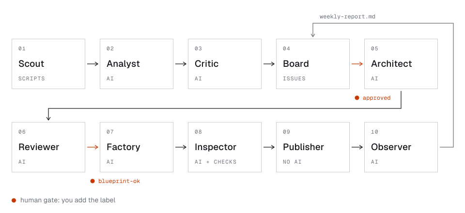

# Greenlight

A personal pipeline that turns internet signals into small shipped web products, mostly run by AI agents,
on €0 beyond a Claude Pro plan. Everything runs on personal accounts using only free tiers: GitHub
(Issues, Projects, Actions), Cloudflare Workers/R2/Web Analytics, and MongoDB Atlas M0.

Its first product, [opt-out-log](https://github.com/yangxdev/opt-out-log), went from idea card to live site through
the whole pipeline in 16 minutes of machine time.

## What it does

1. **Scout** (daily, no AI) collects posts where people describe a problem: Hacker News, Stack Exchange, Discourse
   forums, GitHub feature requests, Lemmy, Bluesky and Lobsters, plus Product Hunt and GitHub launches as a
   competition check.
2. **Analyst** (weekly) clusters them into idea cards. **Critic** checks every quote against the sources, scores the
   cards on four criteria, estimates each one's size, and files at most three as GitHub issues. Most ideas die here;
   near misses go on a [watchlist](analysis/watchlist.md) until more evidence turns up.
3. **You** add `approved` to an idea you want, or jot down your own with a quick note, which the **Scribe** turns into
   a full card.
4. **Architect** creates the product repo and writes a blueprint of at most 10 tasks. A **Reviewer** with a fresh
   context checks and repairs it.
5. **You** add `blueprint-ok`. This is the one decision that spends a build.
6. **Factory** implements the tasks and opens a pull request. **Inspector** runs the checks and an AI review, then
   merges or sends it back for a fix, at most three rounds.
7. **Publisher** (no AI) deploys to Cloudflare, smoke-tests it and puts the live link and screenshots in the README.
8. **Observer** (weekly) reports uptime and visits with a keep, improve or archive verdict per product, which the next
   Analyst run reads. An `improve` verdict files a change request under the product's issue.
9. **Changes** to a live product are sub-issues of its idea issue and go through the same two gates: the Architect
   writes a change spec of at most five tasks against the product's code, the Factory builds it on the existing repo,
   and the product stays live throughout. **Template sync** opens a pull request on every live product when the
   template changes, updating the files the product never changed.

Stages hand off through **markdown files and labels, not chat**: idea cards, blueprints, build reports and weekly
reports, all in [templates/](templates). [compass.md](compass.md) holds the interests, stack, no-go list and the
meaning of "good" that the agents follow.

## First run

opt-out-log on 30 September 2026, from the Analyst starting on stored signals to the site answering its health check.
Times come from the workflow runs and the bot comments on the idea's issue.

| Step | Took |
|------|------|
| Analyst + Critic: signals to an `idea` issue | 3 min 28 s |
| Architect + Reviewer: `approved` to a reviewed blueprint | 3 min 1 s |
| Factory: `blueprint-ok` to a pull request | 6 min 45 s |
| Inspector: review, checks and merge | 1 min 22 s |
| Publisher: deploy and smoke test | 1 min 2 s |
| **Total** | **15 min 38 s** |

Time spent at the two human gates isn't counted, and neither is the Scout's daily fetch, which happens beforehand.

## Design choices

- **AI only where judgement is needed.** Fetching, ranking, repo creation, checks, merges, deploys and labels are
  plain scripts. Every agent has a turn limit and only one product builds at a time, so a Pro plan's usage is enough.
- **No AI job holds a write token.** Agents work in jobs with read-only credentials and hand files to separate
  credentialed jobs that run no AI and no repository code.
- **Evidence over enthusiasm.** The Critic scores an idea 0 for pain when its quotes aren't in the collected signals,
  and an empty week is a valid outcome.
- **One look, two layouts.** Every product is built from the same [template](template) and
  [design language](DESIGN.md). Tools open on the tool itself (`app`); only products meant to be read get a headline
  and numbered sections (`page`). The blueprint picks one.

## Docs

- [How it works](docs/HOW-IT-WORKS.md): every stage in detail, the label state machine, the repo layout, usage
  limits and the security model.
- [Setup](docs/SETUP.md): run your own copy, about an hour.
- [Scout](scout/README.md) and [Observer](observer/README.md): the data scripts, their sources and configuration.

## Roadmap

All nine actors exist. The next steps depend on running them for real:
- Tune `compass.md`, `scout/config.json` (sources, thresholds, pain phrases) and the Critic threshold based on the
  first few weeks of `analysis/` output.
- Key-action tracking: the Observer reports "no data" for each product's key action until products emit a counted event
  (for example a tiny `/api/event` Function writing to MongoDB).

## License

[MIT](LICENSE.md). Every product repo gets its own MIT `LICENSE.md` from `template/`, in the name of the account that
owns it and dated the year it was created.
