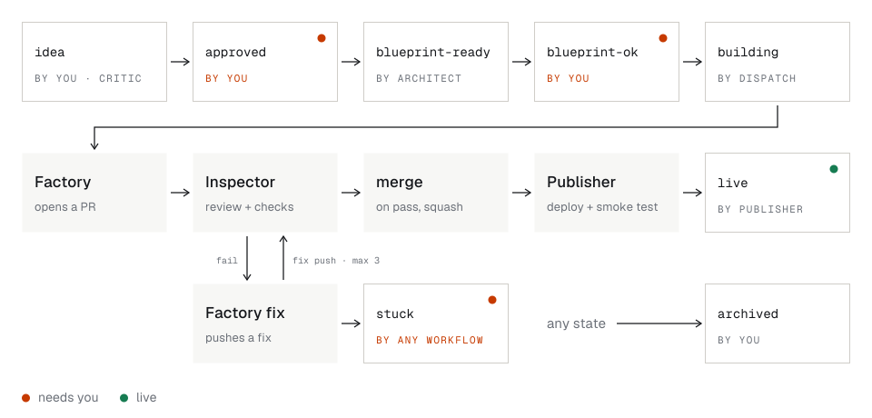

# How Greenlight works

The full mechanics behind the [README](../README.md): every stage, the label state machine, the repo layout,
the usage budget and the security model. To run your own copy, see [SETUP.md](SETUP.md).

## The stages

0. **Scout** (`scout.yml`, daily, no AI) stores signals. On Mondays its scheduled run starts the **Observer** (step 8),
   which then starts **Ideas**. GitHub sometimes starts scheduled runs hours late, so the weekly steps follow each other
   rather than clock times. Each has a Monday-afternoon fallback schedule, and skips itself when its output (this week's
   report, today's analysis) already exists. Started by hand, they always run. **Ideas** (`ideas.yml`):
   - `export` (no AI) takes the ranked Scout export (about 150 problem signals), a separate competition file of recent
     Product Hunt launches and new GitHub projects (searched, not read whole), and the existing idea titles;
   - the **Analyst** (AI, about 20 turns) writes idea cards to `analysis/<date>.md`;
   - the **Critic** (AI, fresh context, about 15 turns) checks the cards' evidence against the signals and scores them
     on the compass rubric, and estimates each card's size (S, M or L) without scoring it. It writes
     `analysis/<date>-critic.md` and returns a JSON verdict. Cards scoring 11–13 go on `analysis/watchlist.md` with
     their verified evidence; the next weeks' Analysts check new signals against it, so a problem that comes up once a
     month can still add up to a filed idea. Delete an entry to stop watching it;
   - `publish` (no AI) commits `analysis/` and files at most `CRITIC_MAX_IDEAS` (3) issues scoring at least
     `CRITIC_MIN_SCORE` (14/20), skipping titles that already exist and defusing @mentions.
   It never adds `approved`, and bot-filed issues trigger nothing.
1. **You** review the `idea` issues, or write your own with the *Idea* form, and add `approved` to the ones you want.
   For a few lines on the go, use the *Quick note* form (`notes.yml`): a note of kind Idea is expanded by the
   **Scribe** (AI, about 8 turns) into an `idea` card, and a note of kind Evidence (someone's complaint you read, on
   Reddit or anywhere) is appended to `analysis/field-notes.md`, which the Analyst and Critic read every week. Only
   your own notes are processed.
2. **Architect** (`architect.yml`, about 20 turns max), in three jobs:
   - `scaffold` (no AI) creates `<you>/<slugified-title>` (public by default) from `template/`, replacing the
     `greenlight-product` placeholder with the repo name. It copies `CLAUDE_CODE_OAUTH_TOKEN`, `GREENLIGHT_TOKEN` and,
     if present, the Cloudflare secrets into the product repo, and sets the variables `GREENLIGHT_REPO`/`GREENLIGHT_ISSUE`;
   - `blueprint` (AI): Claude reads `compass.md`, the issue (plus your comments) and `templates/blueprint.md`, and
     writes only `blueprint.md`, which leaves the job as an artifact;
   - `review` (AI, fresh context, about 20 turns): the **Blueprint Reviewer** checks the draft against a fixed
     checklist (`.claude/agents/blueprint-reviewer.md`): nothing unverified goes live as fact, no task needs what the
     Factory can't do, nothing hard-coded breaks on the first contribution, the template contract holds, every
     criterion is a test, the idea's core pain is still in scope, the compass. It fixes what it can in place and
     returns a verdict (`ready` / `needs-owner`) with its changes and open concerns;
   - `publish` (no AI) checks the blueprint (required sections, 1–10 tasks; the Architect's draft is used if the
     review failed or broke it), commits it, comments the link, the Reviewer's changes and concerns, and a
     `<!-- greenlight:repo=owner/name -->` marker, and sets the label to `blueprint-ready`.
3. **You** read the Reviewer's summary (and `blueprint.md` if you like; edit it freely) and add `blueprint-ok`.
   This gate is deliberately yours: it is the one decision that spends a build.
4. **Factory dispatch** (`factory-dispatch.yml`, no AI) refuses if another issue is `building`, otherwise sends
   `repository_dispatch: greenlight-build` to the product repo and sets the label to `building`.
5. **Factory** (`factory.yml` in the product repo, about 80 turns max). Claude implements the tasks in order, runs
   `npm run check` after each, commits `task N: …`, and writes `build-report.md`. The commits leave the AI job as a
   git bundle. A fresh `verify` job re-runs lint/test/build/audit. `publish` blocks edits to `.github/`, `blueprint.md`
   and `CLAUDE.md`, pushes `factory/build-N`, and opens a PR (a draft if incomplete) with the build report as its body.
6. **Inspector** (`inspector.yml`, on every PR):
   - `checks` (no AI): gitleaks secret scan, `npm ci`, lint, test, build, `npm audit --audit-level=high`;
   - `review` (AI, about 25 turns, only if all checks pass): Claude compares the diff with the blueprint's tasks and
     acceptance criteria and CLAUDE.md's definition of done. It returns a JSON verdict (`--json-schema`) with read-only tools;
   - `decide` (no AI) posts the verdict as a PR comment. On **pass** it merges (squash); set `AUTO_MERGE=false` to merge
     yourself. On **fail** it dispatches `greenlight-fix`, and the Factory reads the findings comment, fixes, and pushes
     to the same branch, which re-triggers the Inspector. After `INSPECTOR_MAX_ROUNDS` (3) failed fix rounds, or if
     the AI review can't finish (e.g. usage limit), the issue becomes `stuck`.
7. **Publisher** (`deploy.yml`, on push to `main`, no AI): builds the app (adding the Web Analytics beacon when the
   product has a `CF_BEACON_TOKEN` variable), runs `wrangler deploy` (Worker + static assets from `wrangler.jsonc`),
   smoke-tests `https://<name>.<you>.workers.dev/api/health` and `/`, comments the live URL, and sets `live`. Then it
   makes the public repo presentable: it sets the repo's website and description (from the live page), photographs
   the live site with the runner's Chrome (light theme, desktop and phone, analytics beacon blocked), and writes the
   live link and the screenshots into the README the Factory filled in, committed with `[skip ci]`. Pushes before the product is built (scaffold, blueprint) are skipped, and so is everything if the
   Cloudflare secrets are missing.
8. **Observer**:
   - `uptime.yml` (every 6 hours, no AI) probes each `live` product's `/api/health` and `/` and stores the result in
     MongoDB, kept 35 days;
   - `observer.yml` (Mondays, between the Scout and Ideas) collects the week's uptime, Cloudflare Web Analytics visits (this week vs
     last), each blueprint's success metric, the board state, and when `GREENLIGHT_TOKEN`, the Cloudflare token and
     the Claude token (from `CLAUDE_TOKEN_EXPIRES`) expire. A token within 30 days of expiry tops the weekly comment;
   - Claude writes `reports/<week>.md` with a keep, improve or archive verdict per product;
   - a shell job commits it and comments the summary on the **Greenlight weekly reports** issue. It comments on a
     product's issue only when its verdict changes, and never touches labels;
   - the next Analyst run reads the report's "Signals for the Analyst". With nothing live, the AI step is skipped and a
     board-only report is written instead.

## After a product is live

A live product changes in two ways, kept apart because one needs judgement and the other doesn't.

**Changes** (AI, through the same stages). A change is an issue labelled `change`, titled `[change] …`, and filed as a
**sub-issue of the product's idea issue**: by you with the *Change* form or the dashboard's "Request a change", or by
the Observer when a product's verdict turns to `improve`. It goes through the same gates as an idea, on the existing
product repo, while the product stays `live`:

1. **You** add `approved`. The Architect reads the change, the product's idea, its blueprint and its code, and writes
   a change spec of **1 to 5 tasks** (`templates/change.md`), committed as `changes/<issue>.md` in the product repo.
   The Reviewer checks it like a blueprint, plus: does it fit the request, does it know the code, does it keep the
   rest working. The issue becomes `blueprint-ready`. No repo is created and the product repo's settings are left alone.
2. **You** add `blueprint-ok`. Factory dispatch (still one build at a time) sends the spec's path; the Factory builds
   it on branch `factory/change-<issue>-<run>`, with `changes/` protected like `blueprint.md`.
3. The Inspector judges the PR against the change spec. It also treats an existing test removed or weakened without
   the spec asking for it as a blocker.
4. On merge the Publisher deploys. The change's issue gets the report and is closed as `shipped`. The product's
   issue never leaves `live`.

The PR body carries `<!-- greenlight:issue=N -->` (and `change=…` for a change), which is how the Inspector and the
Publisher, whose repo variable names only the product's idea issue, report to the right issue.

**Template sync** (no AI). Every product repo records the template version it was built from in
`.greenlight/template`, and `template/.greenlight/owned` lists the files the template owns: `.github/`, `CLAUDE.md`, the
shell and UI components, the tokens, the style guard. When `template/` changes on `main` (or when you run it by hand),
`template-sync.yml` opens or updates a **Template sync** pull request on every live product. For each owned file
(`.github/scripts/template_sync.py`):

- the product's copy equals some version of the template: it was never changed, just behind, so it takes the new one;
- no template version ever had it: the product's own file, kept;
- otherwise it was changed in the product: kept, and listed in the PR.

The product's Inspector runs the checks on it but never merges it (only Factory branches drive the pipeline), so
merging is yours, and it deploys like any push to `main`. Template sync is how fixes to the workflows, `CLAUDE.md` and
the components reach products, including the change support above. It never changes a product's layout: moving a
product from `page` to `app` is a change ("Move to the app layout"), because its screens have to be rebuilt.

Things the Factory can't do for you are listed under "Manual setup required" in the PR's build report: creating an R2
bucket, `npx wrangler secret put MONGODB_URI`, and Atlas network access.

## Usage limits

The Pro plan's usage limits are the real budget:

- **One build at a time.** factory-dispatch checks the `building` label.
- **Every agent has `--max-turns`:** `ARCHITECT_MAX_TURNS` (20), `REVIEWER_MAX_TURNS` (20), and for a change, which reads
  the product's code first, `ARCHITECT_CHANGE_MAX_TURNS` (40) and `REVIEWER_CHANGE_MAX_TURNS` (30); `FACTORY_MAX_TURNS` (80),
  `FIX_MAX_TURNS` (40), `INSPECTOR_MAX_TURNS` (25). At most `INSPECTOR_MAX_ROUNDS` (3) fix rounds per PR. Every job also has a `timeout-minutes`.
  Worst case per product is about 1 Architect + 1 blueprint review + 1 build + 4 reviews + 3 fixes.
- **Weekly idea generation is two short runs:** the Analyst (about 20 turns over about 30k tokens of signals) and the
  Critic (about 15 turns). With no Scout signals, both are skipped.
- **The weekly Observer is one short run** (about 12 turns over a small `metrics.json`), and it's skipped while nothing is live.
  `uptime.yml` exits in seconds when MongoDB isn't set or nothing is live. Otherwise it costs about 4 × 1 billed minute a day.
- **The AI review only runs when deterministic checks pass.** A red check goes back to the Factory with the log, without
  spending a review.
- **No AI in deterministic steps.** Repo creation, secrets, validation, checks, pushes, PRs and labels are all shell.
- **GitHub Actions minutes:** public repos are unlimited; private repos share 2,000 free minutes a month, and a Factory
  run can take up to 90. That is why product repos are public by default (`PRODUCT_VISIBILITY`); secrets stay secret
  either way. Pull requests from forks only get the deterministic checks: the
  Inspector's AI review, merge and fix loop run for the repo's own `factory/*` branches only.

## Security model

Every workflow that runs Claude is split into jobs, so **no AI job and no job that runs repository code ever shares
a runner with `GREENLIGHT_TOKEN` or the Cloudflare token.** Within one job, code can poison later steps (for example
through `$GITHUB_ENV`), so jobs are the security boundary here, not steps.

| Workflow | AI / repo-code jobs (no PAT) | Credentialed jobs (no AI, no repo code) |
|----------|------------------------------|-----------------------------------------|
| Ideas | `analyst`, `critic` (artifacts + JSON verdict out) | `export` (MongoDB), `publish` (`GITHUB_TOKEN` only) |
| Notes | `scribe` (JSON card out) | `read`, `evidence`, `publish` (`GITHUB_TOKEN` only) |
| Observer | `report` (report + JSON verdicts out) | `metrics` (PAT read, Cloudflare, MongoDB), `publish` (`GITHUB_TOKEN` only) |
| Architect | `blueprint`, `review` (artifacts out: blueprint.md; JSON review out) | `scaffold`, `publish` |
| Factory | `agent` (git bundle out), `verify` | `prepare`, `publish` |
| Inspector | `checks`, `review` (JSON verdict out) | `decide` |
| Publisher | `build` (dist/ out), `screenshots` (PNGs out; playwright-core installed outside the repo) | `gate`, `deploy` (`npm ci --ignore-scripts`, wrangler installed outside the repo), `report`, `readme` (git, gh, curl, inline Python) |

- Claude gets the job's short-lived, read-only `GITHUB_TOKEN`. Pushes use the PAT with `core.hooksPath=/dev/null`.
- Gate labels only trigger when you apply them (`github.actor == github.repository_owner`).
- Remaining exposure: the Factory's `agent` job runs code Claude writes (`npm run …`), and that job holds
  `CLAUDE_CODE_OAUTH_TOKEN`. The worst case is someone using your Claude quota. Rotate it with `claude setup-token`
  if you ever suspect that, and keep ideas from the open internet (phase 3) behind your `approved` gate.

## Label state machine

Each idea issue carries exactly one state label. Two transitions are human gates: you add `approved` and `blueprint-ok`.
Changes use the same labels from `approved` to `building`, then end as `shipped` instead of `live`.



| Label | Set by | Meaning / what happens next |
|-------|--------|-----------------------------|
| `note` | Quick note form (you) · dashboard | Not a state: a quick note. `notes.yml` rewrites an Idea note as an `idea` card, or adds an Evidence note to the field notes and closes it |
| `idea` | issue template (you) · Critic (`ideas.yml`, weekly) · Scribe (`notes.yml`) | Idea card waiting for review |
| `approved` | **you** | `architect.yml` creates the product repo, writes `blueprint.md`, comments the link |
| `blueprint-ready` | Architect | Read the Reviewer's summary on the issue; edit `blueprint.md` if needed |
| `blueprint-ok` | **you** | `factory-dispatch.yml` checks nothing else is `building`, then triggers the product's Factory |
| `building` | factory-dispatch | The Factory is implementing the blueprint. **Only one issue at a time.** |
| `live` | Publisher | Deployed to `<name>.<you>.workers.dev` and `/api/health` answered `{ ok: true }` |
| `stuck` | any workflow | Automation gave up. The issue comment links the failed run or PR |
| `archived` | you · Observer suggestion | Dropped or retired. Close the issue too |
| `change` | Change form · dashboard · Observer | Not a state: marks a change to a live product (a sub-issue of its idea issue). With no state label it waits for your `approved`. Swapping it for `approved` is fine: the workflows also recognise a change by its `[change]` title or its parent issue, and put the label back |
| `shipped` | Publisher | A change that was built, merged and deployed. The issue is closed |

Retry anything by removing and re-adding the gate label (`approved` or `blueprint-ok`). A stuck PR can be fixed by
hand: push to its `factory/*` branch and the Inspector re-runs. If it passes, it merges and the Publisher clears `stuck`.
To regenerate a blueprint, comment your feedback on the issue (your comments are passed to the Architect) and re-apply `approved`.

## Repo layout

```
compass.md                  your interests, stack, no-go list, definition of "good"
docs/                       HOW-IT-WORKS.md (this file) and SETUP.md
DESIGN.md                   the design language: tokens, type, layout, registers, image style, mascot brief
assets/diagrams/            README diagrams (SVG, light and dark), drawn by build.py from the DESIGN.md tokens
templates/                  idea.md, blueprint.md, change.md, weekly-report.md (handoff formats)
.claude/agents/             analyst.md, critic.md, scribe.md, architect.md, blueprint-reviewer.md, observer.md (role prompts)
.github/ISSUE_TEMPLATE/     idea.yml (hand-write ideas), note.yml (quick notes), change.yml (ask for a change to a live product)
.github/scripts/            template_sync.py (+ tests): the file comparison behind template-sync.yml
.github/workflows/
  setup-labels.yml          run once: creates the state labels
  architect.yml             on label "approved"
  factory-dispatch.yml      on label "blueprint-ok"
  template-ci.yml           keeps template/ lint/test/build green
  template-sync.yml         on template/ changes: a sync pull request on every live product
  scout.yml                 daily: pull signals into MongoDB (or a JSONL artifact without it); Mondays start the Observer
  uptime.yml                every 6h: probe live products, store history in MongoDB
  board-sync.yml            on label changes: set each card's Status on the Project board from its state label
  observer.yml              weekly, after the Scout: metrics -> Observer report + per-product verdicts; then starts Ideas
  scripts-ci.yml            keeps scout/ and observer/ typechecked, linted, tested
  ideas.yml                 weekly, after the Observer: Analyst + Critic -> analysis/<date>*.md, at most 3 `idea` issues
  notes.yml                 on label "note": Scribe expands an idea note into a card, or evidence goes to field-notes.md
analysis/                   weekly idea cards, Critic verdicts, the near-miss watchlist (ideas.yml) and field notes (notes.yml)
observer/                   Observer data scripts: uptime probes, Web Analytics, weekly metrics.json (see ../observer/README.md)
reports/                    weekly reports (<week>.md) and verdicts (<week>.json), committed by observer.yml
scout/                      Scout: HN, Reddit, GitHub, GitHub issues, Product Hunt, Stack Exchange, Discourse, Lemmy, Bluesky, RSS fetchers + ranked export (see ../scout/README.md)
  config.json               subreddits, feeds, thresholds, pain phrases
template/                   product skeleton copied into every new product repo
  .greenlight/owned         the files template sync keeps up to date (the scaffold adds .greenlight/template)
  CLAUDE.md                 stack conventions, Look & feel (house style), README, R2/Mongo usage, testing rules, definition of done
  README.md                 the product repo's front page: a skeleton the Factory fills; the Publisher adds link and screenshots
  src/index.css             house-style tokens (yangxdev.com / sakana.ai family): colours, type, spacing, motion
  scripts/check-style.ts    house-style guard in `npm run lint`: no rounded cards, shadows, gradients, blur or emoji
  src/components/shell/     two layouts: app (AppShell, AppHeader, ViewHeader, AppFooter, the default) and page
                            (SiteHeader, Hero, Section with its numbered rail, SiteFooter); the blueprint picks one
  src/components/ui/        Button, Segmented, RuledList, CellGrid, DetailList, Pane, Drawer, StatusDot, Field, Note, ...
  src/ worker/ shared/      Vite + React + RTK + Tailwind + TS app, the /api Worker, shared types
  wrangler.jsonc            Cloudflare Worker with static assets (same shape as waypoint / yangxdev.com)
  .github/workflows/
    factory.yml             build from blueprint / fix from Inspector findings
    inspector.yml           checks + AI review on every PR, merge or send back
    deploy.yml              Publisher: `wrangler deploy`, smoke test, "live", repo website, README screenshots
  .github/build-report.md
```

**Why `template/` is a folder, not a GitHub template repo:** the Architect already checks out greenlight, so copying a
folder costs nothing, and template changes land in the same PR as workflow changes that depend on them.
`template-ci.yml` keeps it green. A template repo would only add the "Use this template" button, which nothing here uses.
Either way, products don't change when the template does: `template-sync.yml` brings template changes to them as pull
requests you merge (see "After a product is live").
